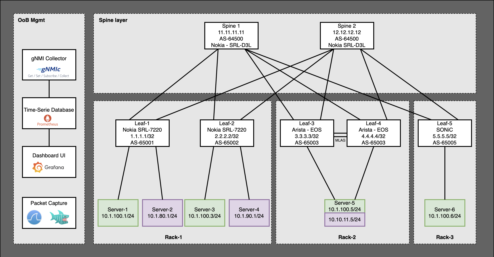

# Multivendor Datacenter Network Fabric

**Authors**: 

[Mohammad Zaman](https://www.linkedin.com/in/mohammad-zaman-61496958/) : GitHub: mfzhsn </br>
[Amer Fakher](https://www.linkedin.com/in/amerf-linkedin/): Github: skyglid3r

## 📑 Table of Contents

   * [🗺️ Topology](#-topology)
   * [📚 Workshop Overview](#-workshop-overview)
   * [🛠️ Tools Used](#-tools-used)
   * [Deploy the lab](#deploy-the-lab)
   * [Activities](#activities)
      + [Building BGP EVPN Control Plane](#building-bgp-evpn-control-plane)
      + [Verification](#verification)
         - [Control Plane Verification](#control-plane-verification)
         - [Layer 2 Data Plane Verification](#layer-2-data-plane-verification)
         - [Layer 3 Data Plane Verification](#layer-3-data-plane-verification)
      + [Bonus Activity](#bonus-activity-enable-layer-3-evpn-type-5-on-sonic)
      + [Streaming Metrics using gNMI](#streaming-metrics-using-gnmi)
      + [Packet Capture using Wireshark/EdgeShark](#packet-capture-using-wiresharkedgeshark)
      + [MultiCLI on Nokia SR Linux](#multicli-on-nokia-sr-linux)

## 🗺️ Topology



## 📚 Workshop Overview

In this workshop, we will build a data centre fabric using a **Clos/Leaf-Spine topology** and incorporate switches from multiple vendors (e.g., Nokia SR Linux, Arista EOS, SONiC. 

By the end of the workshop, participants will:

- Understand the design principles behind modern data centre fabrics.
- Deploy a Clos-based topology using multivendor devices.
- Configure BGP EVPN for VXLAN-based Layer 2/Layer 3 fabric overlays.
- Streaming Telemetry using gNMI.
- Edgeshark to collect packet catures
- Validate connectivity and troubleshoot fabric issues.

We will be using either **virtual lab environments** built using [containerlab](http://containerlab.dev).

---

## 🛠️ Tools Used

| Tool            | Description                                                                 |
|-----------------|-----------------------------------------------------------------------------|
| `containerlab`  | Orchestrator for container-based virtual network labs                        |
| `Nokia SR Linux`| Model-driven network OS with native gNMI and YANG-based management           |
| `Arista EOS`    | Extensible network OS for Arista switches with advanced programmability      |
| `SONiC`         | Open-source network OS used in hyperscale data centers, built on Linux       |
| `gnmic`         | Lightweight gNMI CLI client for configuring and streaming telemetry data     |
| `Prometheus`    | Open-source monitoring and alerting toolkit used for collecting metrics      |
| `Grafana`       | Analytics and visualization tool for monitoring data from sources like Prometheus |
| `Wireshark`     | Network protocol analyzer for capturing and inspecting traffic               |
| `EdgeShark`     | Web-based pcap viewer and packet analysis tool for browser-based inspections |


## 🔐 Login Details

| **Tool**         | **Login Details**                      |
|------------------|----------------------------------------|
| `Nokia SRLinux`  | `admin` / `NokiaSrl1!`                 |
| `Asista EOS`     | `admin` / `admin`                      |
| `SONiC`          | `admin` / `admin`                      |
| `Clients`        | `root` / `password`                    |
| `Prometheus`     | `http://<VM_IP>:9090`                  |
| `Grafana`        | `http://<VM_IP>:3000`, admin/admin     |
| `Edge Shark UI`  | `http://<VM_IP>:5001`                  |

## Deploy the lab

**Clone the repo**

```bash
git clone https://github.com/learn-nokia/dc-multivendor.git && cd dc-multivendor
```

**Deploy the Lab**
Once the repo is cloned, run the containerlab topology:

```bash
containerlab deploy -t dc-topology.clab.yml
```

## Activities

### Building BGP EVPN Control Plane

**Rack-1: Leaf-1 SRLinux**

BGP IPv4 Configurations:

```
enter candidate
```

```
set / network-instance default protocols bgp admin-state enable
set / network-instance default protocols bgp autonomous-system 65001
set / network-instance default protocols bgp router-id 1.1.1.1
set / network-instance default protocols bgp ebgp-default-policy import-reject-all false
set / network-instance default protocols bgp ebgp-default-policy export-reject-all false
set / network-instance default protocols bgp afi-safi ipv4-unicast admin-state enable
set / network-instance default protocols bgp group ebgp admin-state enable
set / network-instance default protocols bgp group ebgp peer-as 64500
set / network-instance default protocols bgp group ebgp afi-safi ipv4-unicast admin-state enable
set / network-instance default protocols bgp neighbor 192.168.10.3 description underlay_spine-1
set / network-instance default protocols bgp neighbor 192.168.10.3 peer-group ebgp
set / network-instance default protocols bgp neighbor 192.168.10.3 export-policy [ export-underlay-v4 ]
set / network-instance default protocols bgp neighbor 192.168.10.3 afi-safi ipv6-unicast admin-state disable
set / network-instance default protocols bgp neighbor 192.168.110.3 description underlay_spine-2
set / network-instance default protocols bgp neighbor 192.168.110.3 peer-group ebgp
set / network-instance default protocols bgp neighbor 192.168.110.3 export-policy [ export-underlay-v4 ]
set / network-instance default protocols bgp neighbor 192.168.110.3 afi-safi ipv6-unicast admin-state disable
```

EVPN Configurations:

```
set / network-instance default protocols bgp group evpn admin-state enable
set / network-instance default protocols bgp group evpn multihop admin-state enable
set / network-instance default protocols bgp group evpn multihop maximum-hops 255
set / network-instance default protocols bgp group evpn afi-safi evpn admin-state enable
set / network-instance default protocols bgp group evpn afi-safi ipv4-unicast admin-state disable
set / network-instance default protocols bgp group evpn afi-safi ipv6-unicast admin-state disable
set / network-instance default protocols bgp group evpn local-as as-number 65001
set / network-instance default protocols bgp neighbor 11.11.11.11 admin-state enable
set / network-instance default protocols bgp neighbor 11.11.11.11 description SPINE1_overlay
set / network-instance default protocols bgp neighbor 11.11.11.11 peer-as 64500
set / network-instance default protocols bgp neighbor 11.11.11.11 peer-group evpn
set / network-instance default protocols bgp neighbor 11.11.11.11 local-as as-number 65001
set / network-instance default protocols bgp neighbor 11.11.11.11 transport local-address 1.1.1.1
set / network-instance default protocols bgp neighbor 12.12.12.12 admin-state enable
set / network-instance default protocols bgp neighbor 12.12.12.12 description SPINE1_overlay
set / network-instance default protocols bgp neighbor 12.12.12.12 peer-as 64500
set / network-instance default protocols bgp neighbor 12.12.12.12 peer-group evpn
set / network-instance default protocols bgp neighbor 12.12.12.12 local-as as-number 65001
set / network-instance default protocols bgp neighbor 12.12.12.12 transport local-address 1.1.1.1
```

Merge the newly entered configurations to running
 
```
commit save
```

**Rack-2: Leaf-3 EOS**

```
router bgp 65003
   router-id 10.255.0.3
   no bgp default ipv4-unicast
   maximum-paths 4 ecmp 4
   neighbor EVPN-OVERLAY-PEERS peer group
   neighbor EVPN-OVERLAY-PEERS update-source Loopback0
   neighbor EVPN-OVERLAY-PEERS bfd
   neighbor EVPN-OVERLAY-PEERS ebgp-multihop 3
   neighbor EVPN-OVERLAY-PEERS send-community
   neighbor EVPN-OVERLAY-PEERS maximum-routes 0
   neighbor IPv4-UNDERLAY-PEERS peer group
   neighbor IPv4-UNDERLAY-PEERS send-community
   neighbor IPv4-UNDERLAY-PEERS maximum-routes 12000
   neighbor MLAG-IPv4-UNDERLAY-PEER peer group
   neighbor MLAG-IPv4-UNDERLAY-PEER remote-as 65003
   neighbor MLAG-IPv4-UNDERLAY-PEER next-hop-self
   neighbor MLAG-IPv4-UNDERLAY-PEER description dc1-leaf1b
   neighbor MLAG-IPv4-UNDERLAY-PEER route-map RM-MLAG-PEER-IN in
   neighbor MLAG-IPv4-UNDERLAY-PEER send-community
   neighbor MLAG-IPv4-UNDERLAY-PEER maximum-routes 12000
   neighbor 11.11.11.11 peer group EVPN-OVERLAY-PEERS
   neighbor 11.11.11.11 remote-as 64500
   neighbor 11.11.11.11 description spine1_dc1_srlinux
   neighbor 12.12.12.12 peer group EVPN-OVERLAY-PEERS
   neighbor 12.12.12.12 remote-as 64500
   neighbor 12.12.12.12 description spine2_dc1_srlinux
   neighbor 192.168.30.3 peer group IPv4-UNDERLAY-PEERS
   neighbor 192.168.30.3 remote-as 64500
   neighbor 192.168.30.3 description spine1_dc1_rack1
   neighbor 192.168.130.3 peer group IPv4-UNDERLAY-PEERS
   neighbor 192.168.130.3 remote-as 64500
   neighbor 192.168.130.3 description spine2_dc1_rack1
   redistribute connected route-map RM-CONN-2-BGP
```

**Rack-3: Leaf-5 SONiC**

Before pushing the BGP Config, You need to configure L3 Interfaces or you can use the provided script which would do the same.

```
./sonic_config.sh
```

Wait a few minutes before entering BGP configurations, as SONiC tries to bring up all services when a `config reload` is performed from the last script.

1. Step-1: Login to Leaf-5

```
ssh admin@leaf5
``` 
password: admin


2. Step-2: Login to `vtysh` console

```
vtysh
```

3. Step-3: Enter these commands by entering into `enable` mode and then `configure terminal`.

```
router bgp 65005
 bgp router-id 5.5.5.5
 no bgp ebgp-requires-policy
 neighbor 11.11.11.11 remote-as 64500
 neighbor 11.11.11.11 ebgp-multihop 5
 neighbor 12.12.12.12 remote-as 64500
 neighbor 12.12.12.12 ebgp-multihop 5
 neighbor 192.168.50.3 remote-as 64500
 neighbor 192.168.150.3 remote-as 64500
 !
 address-family ipv4 unicast
  network 5.5.5.5/32
  redistribute connected
 exit-address-family
 !
 address-family l2vpn evpn
  neighbor 11.11.11.11 activate
  neighbor 12.12.12.12 activate
  advertise-all-vni
  vni 100
   route-target import 65500:100
   route-target export 65500:100
  exit-vni
 exit-address-family
exit
!
```

### Verification

Traffic verification is a critical part of validating the functionality and reliability of the data centre fabric. This section outlines the various tools and techniques used during the workshop to verify L2/L3 connectivity, inspect packet paths, analyze control plane behavior, and monitor real-time metrics across the multivendor environment.

---

#### Control Plane Verification

We verify L2 reachability by simulating hosts connected to different leaf switches and checking their ability to communicate over VXLAN tunnels. These tunnels are dynamically established through the BGP EVPN control plane. Layer-2 communication across the fabric relies heavily on the correct propagation of MAC and VTEP information.

Key aspects of L2 verification include:

- Validating **MAC address learning** across the EVPN control plane
- Using `ping` and `arping` between hosts on the same VLAN (aka EVPN EVI)
- Ensuring correct **BUM (Broadcast, Unknown unicast, and Multicast)** replication over VXLAN

**🔍 EVPN Route Types Involved**

To support L2 connectivity over VXLAN, several BGP EVPN route types come into play:

- **Type 2: MAC/IP Advertisement Route**
  - Advertises the association between a MAC address (and optionally an IP address) and its VTEP.
  - Essential for MAC learning across VTEPs without flooding.
  - Example: When Host A's MAC is learned on Leaf 1, a Type 2 route is advertised to all other VTEPs so they can forward traffic directly.

- **Type 3: Inclusive Multicast Ethernet Tag Route**
  - Used to signal the existence of a VTEP participating in a particular VLAN (or EVPN Instance).
  - Enables remote VTEPs to build VXLAN multicast or head-end replication (HER) groups for BUM traffic.
  - Example: When Leaf 2 joins VLAN 100, it advertises a Type 3 route to inform other leaves to replicate BUM traffic to it.

> 💡 These EVPN route types reduce the need for data-plane MAC learning and ensure control-plane-based population of forwarding tables, making L2 fabric behavior deterministic and scalable.

**✅ Validation Steps:**

- Confirm EVPN Type 2 routes are installed in each node's BGP EVPN RIB
- Inspect VXLAN tunnel creation between leaf VTEPs
- Validate BUM replication via `ping` to unknown MACs and ARP broadcasts
- Monitor ARP tables and FIB entries for accurate MAC/IP-to-VTEP mappings


**Nokia SRLinux**

Command:

```
show network-instance default protocols bgp routes evpn route-type summary
```

```
A:admin@leaf1# show network-instance default protocols bgp routes evpn route-type summary
------------------------------------------------------------------------------------------------------------------------------------------------------------------------------------
Show report for the BGP route table of network-instance "default"
------------------------------------------------------------------------------------------------------------------------------------------------------------------------------------
Status codes: u=used, *=valid, >=best, x=stale, b=backup
Origin codes: i=IGP, e=EGP, ?=incomplete
------------------------------------------------------------------------------------------------------------------------------------------------------------------------------------
BGP Router ID: 1.1.1.1      AS: 65001      Local AS: 65001
------------------------------------------------------------------------------------------------------------------------------------------------------------------------------------
Type 2 MAC-IP Advertisement Routes
+-------+---------------+-----------+-----------------+---------------+---------------+-------+---------------+---------------+-----------------------------+---------------+
| Statu |    Route-     |  Tag-ID   |   MAC-address   |  IP-address   |   neighbor    | Path- |   Next-Hop    |     Label     |             ESI             | MAC Mobility  |
|   s   | distinguisher |           |                 |               |               |  id   |               |               |                             |               |
+=======+===============+===========+=================+===============+===============+=======+===============+===============+=============================+===============+
| u*>   | 2.2.2.2:100   | 0         | 1A:24:09:FF:00: | 0.0.0.0       | 11.11.11.11   | 0     | 2.2.2.2       | 100           | 00:00:00:00:00:00:00:00:00: | Seq:0/Static  |
|       |               |           | 42              |               |               |       |               |               | 00                          |               |
| *     | 2.2.2.2:100   | 0         | 1A:24:09:FF:00: | 0.0.0.0       | 12.12.12.12   | 0     | 2.2.2.2       | 100           | 00:00:00:00:00:00:00:00:00: | Seq:0/Static  |
|       |               |           | 42              |               |               |       |               |               | 00                          |               |
| u*>   | 2.2.2.2:100   | 0         | 1A:24:09:FF:00: | 172.16.10.253 | 11.11.11.11   | 0     | 2.2.2.2       | 100           | 00:00:00:00:00:00:00:00:00: | Seq:0/Static  |
|       |               |           | 42              |               |               |       |               |               | 00                          |               |
| *     | 2.2.2.2:100   | 0         | 1A:24:09:FF:00: | 172.16.10.253 | 12.12.12.12   | 0     | 2.2.2.2       | 100           | 00:00:00:00:00:00:00:00:00: | Seq:0/Static  |
|       |               |           | 42              |               |               |       |               |               | 00                          |               |
| u*>   | 10.255.0.3:10 | 0         | AA:C1:AB:24:E7: | 0.0.0.0       | 11.11.11.11   | 0     | 10.255.1.3    | 100           | 00:00:00:00:00:00:00:00:00: | -             |
|       | 100           |           | CF              |               |               |       |               |               | 00                          |               |
| *     | 10.255.0.3:10 | 0         | AA:C1:AB:24:E7: | 0.0.0.0       | 12.12.12.12   | 0     | 10.255.1.3    | 100           | 00:00:00:00:00:00:00:00:00: | -             |
|       | 100           |           | CF              |               |               |       |               |               | 00                          |               |
+-------+---------------+-----------+-----------------+---------------+---------------+-------+---------------+---------------+-----------------------------+---------------+
------------------------------------------------------------------------------------------------------------------------------------------------------------------------------------
Type 3 Inclusive Multicast Ethernet Tag Routes
+--------+-----------------------------------------+------------+---------------------+-----------------------------------------+--------+-----------------------------------------+
| Status |           Route-distinguisher           |   Tag-ID   |    Originator-IP    |                neighbor                 | Path-  |                Next-Hop                 |
|        |                                         |            |                     |                                         |   id   |                                         |
+========+=========================================+============+=====================+=========================================+========+=========================================+
| u*>    | 2.2.2.2:100                             | 0          | 2.2.2.2             | 11.11.11.11                             | 0      | 2.2.2.2                                 |
| *      | 2.2.2.2:100                             | 0          | 2.2.2.2             | 12.12.12.12                             | 0      | 2.2.2.2                                 |
| u*>    | 5.5.5.5:3                               | 0          | 55.55.55.55         | 11.11.11.11                             | 0      | 55.55.55.55                             |
| u*>    | 10.255.0.3:10100                        | 0          | 10.255.1.3          | 11.11.11.11                             | 0      | 10.255.1.3                              |
| *      | 10.255.0.3:10100                        | 0          | 10.255.1.3          | 12.12.12.12                             | 0      | 10.255.1.3                              |
+--------+-----------------------------------------+------------+---------------------+-----------------------------------------+--------+-----------------------------------------+
------------------------------------------------------------------------------------------------------------------------------------------------------------------------------------
Type 5 IP Prefix Routes
+--------+------------------------+------------+---------------------+------------------------+--------+------------------------+------------------------+------------------------+
| Status |  Route-distinguisher   |   Tag-ID   |     IP-address      |        neighbor        | Path-  |        Next-Hop        |         Label          |        Gateway         |
|        |                        |            |                     |                        |   id   |                        |                        |                        |
+========+========================+============+=====================+========================+========+========================+========================+========================+
| u*>    | 2.2.2.2:200            | 0          | 10.90.1.0/24        | 11.11.11.11            | 0      | 2.2.2.2                | 200                    | 0.0.0.0                |
| *      | 2.2.2.2:200            | 0          | 10.90.1.0/24        | 12.12.12.12            | 0      | 2.2.2.2                | 200                    | 0.0.0.0                |
| u*>    | 2.2.2.2:200            | 0          | 172.16.10.0/24      | 11.11.11.11            | 0      | 2.2.2.2                | 200                    | 0.0.0.0                |
| *      | 2.2.2.2:200            | 0          | 172.16.10.0/24      | 12.12.12.12            | 0      | 2.2.2.2                | 200                    | 0.0.0.0                |
| u*>    | 2.2.2.2:200            | 0          | 10:90:1::/64        | 11.11.11.11            | 0      | 2.2.2.2                | 200                    | ::                     |
| *      | 2.2.2.2:200            | 0          | 10:90:1::/64        | 12.12.12.12            | 0      | 2.2.2.2                | 200                    | ::                     |
+--------+------------------------+------------+---------------------+------------------------+--------+------------------------+------------------------+------------------------+
------------------------------------------------------------------------------------------------------------------------------------------------------------------------------------
0 Ethernet Auto-Discovery routes 0 used, 0 valid
6 MAC-IP Advertisement routes 3 used, 6 valid
5 Inclusive Multicast Ethernet Tag routes 3 used, 5 valid
0 Ethernet Segment routes 0 used, 0 valid
6 IP Prefix routes 3 used, 6 valid
0 Selective Multicast Ethernet Tag routes 0 used, 0 valid
0 Selective Multicast Membership Report Sync routes 0 used, 0 valid
0 Selective Multicast Leave Sync routes 0 used, 0 valid
------------------------------------------------------------------------------------------------------------------------------------------------------------------------------------

```

**Arista EOS**

Command:

```
show bgp evpn
```

```
leaf3#show bgp evpn
BGP routing table information for VRF default
Router identifier 10.255.0.3, local AS number 65003
Route status codes: * - valid, > - active, S - Stale, E - ECMP head, e - ECMP
                    c - Contributing to ECMP, % - Pending best path selection
Origin codes: i - IGP, e - EGP, ? - incomplete
AS Path Attributes: Or-ID - Originator ID, C-LST - Cluster List, LL Nexthop - Link Local Nexthop

          Network                Next Hop              Metric  LocPref Weight  Path
 * >Ec    RD: 2.2.2.2:100 mac-ip 1a24.09ff.0042
                                 2.2.2.2               -       100     0       64500 65002 i
 *  ec    RD: 2.2.2.2:100 mac-ip 1a24.09ff.0042
                                 2.2.2.2               -       100     0       64500 65002 i
 * >Ec    RD: 2.2.2.2:100 mac-ip 1a24.09ff.0042 172.16.10.253
                                 2.2.2.2               -       100     0       64500 65002 i
 *  ec    RD: 2.2.2.2:100 mac-ip 1a24.09ff.0042 172.16.10.253
                                 2.2.2.2               -       100     0       64500 65002 i
 * >Ec    RD: 1.1.1.1:100 mac-ip 1aa8.08ff.0042
                                 1.1.1.1               -       100     0       64500 65001 i
 *  ec    RD: 1.1.1.1:100 mac-ip 1aa8.08ff.0042
                                 1.1.1.1               -       100     0       64500 65001 i
 * >Ec    RD: 1.1.1.1:100 mac-ip 1aa8.08ff.0042 172.16.10.254
                                 1.1.1.1               -       100     0       64500 65001 i
 *  ec    RD: 1.1.1.1:100 mac-ip 1aa8.08ff.0042 172.16.10.254
                                 1.1.1.1               -       100     0       64500 65001 i
 * >Ec    RD: 1.1.1.1:100 mac-ip aac1.ab01.905b
                                 1.1.1.1               -       100     0       64500 65001 i
 *  ec    RD: 1.1.1.1:100 mac-ip aac1.ab01.905b
                                 1.1.1.1               -       100     0       64500 65001 i
 * >      RD: 10.255.0.3:10100 mac-ip aac1.ab24.e7cf
                                 -                     -       -       0       i
```

**SONiC**

Command:

```
show bgp l2vpn evpn
```


```
sonic# show bgp l2vpn evpn
BGP table version is 124, local router ID is 5.5.5.5
Status codes: s suppressed, d damped, h history, * valid, > best, i - internal
Origin codes: i - IGP, e - EGP, ? - incomplete
EVPN type-1 prefix: [1]:[EthTag]:[ESI]:[IPlen]:[VTEP-IP]:[Frag-id]
EVPN type-2 prefix: [2]:[EthTag]:[MAClen]:[MAC]:[IPlen]:[IP]
EVPN type-3 prefix: [3]:[EthTag]:[IPlen]:[OrigIP]
EVPN type-4 prefix: [4]:[ESI]:[IPlen]:[OrigIP]
EVPN type-5 prefix: [5]:[EthTag]:[IPlen]:[IP]

   Network          Next Hop            Metric LocPrf Weight Path
Route Distinguisher: 1.1.1.1:100
 *> [2]:[0]:[48]:[1a:a8:08:ff:00:42]
                    1.1.1.1                                0 64500 65001 i
                    RT:65500:100 ET:8 MM:0, sticky MAC
 *> [2]:[0]:[48]:[1a:a8:08:ff:00:42]:[32]:[172.16.10.254]
                    1.1.1.1                                0 64500 65001 i
                    RT:65500:100 ET:8 MM:0, sticky MAC
 *> [2]:[0]:[48]:[aa:c1:ab:01:90:5b]
                    1.1.1.1                                0 64500 65001 i
                    RT:65500:100 ET:8
 *> [3]:[0]:[32]:[1.1.1.1]
                    1.1.1.1                                0 64500 65001 i
                    RT:65500:100 ET:8
Route Distinguisher: 1.1.1.1:200
 *> [5]:[0]:[24]:[10.80.1.0]
                    1.1.1.1                                0 64500 65001 i
                    RT:65500:200 ET:8 Rmac:1a:a8:08:ff:00:00
 *> [5]:[0]:[24]:[172.16.10.0]

```


> 🔎 Tools like `vtysh`, `gnmic`, `tcpdump`, or vendor-specific CLI (`show evpn`, `show vxlan`, etc.) can be used to inspect EVPN advertisements and data-plane behavior.


####  Layer 2 Data Plane Verification

Running Layer 2 Traffic Across All the Racks

1. ICMP Traffic from Client-1 to Client-3 

```
client1:~# ip a sh eth1
120: eth1@if121: <BROADCAST,MULTICAST,UP,LOWER_UP> mtu 9500 qdisc noqueue state UP group default
    link/ether aa:c1:ab:72:a4:65 brd ff:ff:ff:ff:ff:ff link-netnsid 1
    inet 10.1.100.1/24 scope global eth1
       valid_lft forever preferred_lft forever
    inet6 fe80::a8c1:abff:fe72:a465/64 scope link
       valid_lft forever preferred_lft forever


client1:~# ping 10.1.100.3
PING 10.1.100.3 (10.1.100.3) 56(84) bytes of data.
64 bytes from 10.1.100.3: icmp_seq=1 ttl=64 time=1.23 ms
64 bytes from 10.1.100.3: icmp_seq=2 ttl=64 time=0.949 ms
64 bytes from 10.1.100.3: icmp_seq=3 ttl=64 time=0.882 ms
```

2. ICMP Traffic from Client-1 to Client-5 (Rack-1 to Rack-2) 

```
client1:~# ip a sh eth1
27: eth1@if28: <BROADCAST,MULTICAST,UP,LOWER_UP> mtu 9500 qdisc noqueue state UP group default
    link/ether aa:c1:ab:b8:3f:bb brd ff:ff:ff:ff:ff:ff link-netnsid 1
    inet 10.1.100.1/24 scope global eth1
       valid_lft forever preferred_lft forever
    inet6 fe80::a8c1:abff:feb8:3fbb/64 scope link
       valid_lft forever preferred_lft forever
client1:~#
client1:~#
client1:~#
client1:~# ping 10.1.100.5
PING 10.1.100.5 (10.1.100.5) 56(84) bytes of data.
64 bytes from 10.1.100.5: icmp_seq=1 ttl=64 time=1.94 ms
64 bytes from 10.1.100.5: icmp_seq=2 ttl=64 time=1.41 ms
64 bytes from 10.1.100.5: icmp_seq=3 ttl=64 time=1.56 ms
```

3. ICMP Traffic from Client-1 to Client-6 (Rack-1 to Rack-3)

```
client1:~# ip a sh eth1
120: eth1@if121: <BROADCAST,MULTICAST,UP,LOWER_UP> mtu 9500 qdisc noqueue state UP group default
    link/ether aa:c1:ab:72:a4:65 brd ff:ff:ff:ff:ff:ff link-netnsid 1
    inet 10.1.100.1/24 scope global eth1
       valid_lft forever preferred_lft forever
    inet6 fe80::a8c1:abff:fe72:a465/64 scope link
       valid_lft forever preferred_lft forever

client1:~#
client1:~# ping 10.1.100.6
PING 10.1.100.6 (10.1.100.6) 56(84) bytes of data.
64 bytes from 10.1.100.6: icmp_seq=1 ttl=64 time=1.38 ms
64 bytes from 10.1.100.6: icmp_seq=2 ttl=64 time=1.39 ms
64 bytes from 10.1.100.6: icmp_seq=3 ttl=64 time=1.33 ms
64 bytes from 10.1.100.6: icmp_seq=4 ttl=64 time=1.34 ms
``` 

---

#### Layer 3 Data Plane Verification

To validate inter-subnet communication across the fabric, we simulate hosts in different IP subnets connected to different leaf switches. Layer-3 forwarding in modern EVPN-VXLAN fabrics is typically EVPN **Type 5** routes for scalable and efficient routing.

- **Type 5: IP Prefix Route**
  - Advertises IP prefixes in EVPN to enable L3 reachability across different subnets.
  - These routes are used in inter-subnet forwarding (e.g., Host A in subnet 10.0.1.0/24 to Host B in 10.0.2.0/24).
  - Typically originates from a VRF or L3VNI.

**✅ Validation Steps:**

- Ping between hosts in **different subnets** connected to **different leaf switches**.
- Verify that Type 5 routes are present in the EVPN RIB of each fabric node.

Layer 3 Traffic Between two different networks (client-2 to client-4)

Client-2: 10.80.1.1/24</br>
Client-4: 10.90.1.1/24

```
client2:~# ip a sh eth1
1230: eth1@if1231: <BROADCAST,MULTICAST,UP,LOWER_UP> mtu 9500 qdisc noqueue state UP group default
    link/ether aa:c1:ab:5b:63:7e brd ff:ff:ff:ff:ff:ff link-netnsid 1
    inet 10.80.1.1/24 scope global eth1
       valid_lft forever preferred_lft forever
    inet6 fe80::a8c1:abff:fe5b:637e/64 scope link
       valid_lft forever preferred_lft forever

...
...
 
client2:~# ping 10.90.1.1
PING 10.90.1.1 (10.90.1.1) 56(84) bytes of data.
64 bytes from 10.90.1.1: icmp_seq=1 ttl=253 time=1.05 ms
64 bytes from 10.90.1.1: icmp_seq=2 ttl=253 time=1.10 ms
64 bytes from 10.90.1.1: icmp_seq=3 ttl=253 time=1.04 ms
     
```

> 🔍 *Expected Result:* IP traffic successfully routed through the fabric.

---

### Bonus Activity: Enable Layer 3 EVPN (Type-5) on SONiC

  
1. Create VLAN 

```
sudo config vlan add 200
```
 
2. Create VRF

``` 
sudo config vrf add Vrf_Type5
```

3. Bind VLAN to VRF

``` 
sudo config interface vrf bind Vlan200 Vrf_Type5
```

4. Add IP to VLAN after associating Vlan200 to VRF

```
sudo config interface ip add Vlan 200 50.50.50.1/24
```

5. Map VLAN to VNI

``` 
sudo config vxlan map add vtep 200 200
```
 
6. Assoicate VNI to VRF

``` 
sudo config vrf add_vrf_vni_map Vrf_Type5 200
```

7. Update BGP Configs at FRR by vtysh console:

```
vrf Vrf_Type5
vni 200
ip router-id 5.5.5.5
 
router bgp 65005 vrf Vrf_Type5
!
address-family ipv4 unicast
  network 50.50.50.0/24
exit-address-family
!
address-family l2vpn evpn
  advertise ipv4 unicast
  route-target import 65500:200
  route-target export 65500:200
exit-address-family
exit
```

**Verification**

Verify the entries in the routing table on Leaf-1 (Rack-1), locate for IP 50.50.50.0/24 (SONiC Vlan200`s Address)

```
show network-instance ip-vrf-1 route-table
```

Run Layer 3 Traffic from Leaf1 to Leaf5

``` 
ping network-instance ip-vrf-1 50.50.50.1
```

---

### Streaming Metrics using gNMI

Real-time monitoring of operational state and performance is achieved using **gNMI telemetry**:

- Subscribe to interface counters, CPU usage, BGP sessions, etc.

**Native Yang Paths**

```
[root@localhost ~]# gnmic -a leaf1:57400 -u admin -p NokiaSrl1! --skip-verify get --path "/platform/control[slot=*]/cpu[index=all]/total" -e JSON_IETF
[
  {
    "source": "leaf1:57400",
    "timestamp": 1746673125143111714,
    "time": "2025-05-07T21:58:45.143111714-05:00",
    "updates": [
      {
        "Path": "srl_nokia-platform:platform",
        "values": {
          "srl_nokia-platform:platform": {
            "srl_nokia-platform-control:control": [
              {
                "slot": "A",
                "srl_nokia-platform-cpu:cpu": [
                  {
                    "index": "all",
                    "total": {
                      "average-1": 12,
                      "average-15": 11,
                      "average-5": 12,
                      "instant": 21
                    }
                  }
                ]
              }
            ]
          }
        }
      }
    ]
  }
]
```

**Using Open-Config Path**

```
[root@localhost ~]# gnmic -a 172.30.30.6:6030 -u admin -p admin --insecure get --path /interfaces/interface[name=*]/state/oper-status
[
  {
    "source": "172.30.30.6:6030",
    "timestamp": 1746673474095164417,
    "time": "2025-05-07T22:04:34.095164417-05:00",
    "updates": [
      {
        "Path": "interfaces/interface[name=Ethernet1]/state/oper-status",
        "values": {
          "interfaces/interface/state/oper-status": "UP"
        }
      },
      {
        "Path": "interfaces/interface[name=Ethernet2]/state/oper-status",
        "values": {
          "interfaces/interface/state/oper-status": "UP"
        }
      },
      {
        "Path": "interfaces/interface[name=Ethernet3]/state/oper-status",
        "values": {
          "interfaces/interface/state/oper-status": "UP"
        }
      },
      {
        "Path": "interfaces/interface[name=Ethernet4]/state/oper-status",
        "values": {
          "interfaces/interface/state/oper-status": "UP"
        }
      }
```


> 📈 *Outcome:* Live visibility into fabric health, link utilization, and protocol state across all nodes.

---

### Packet Capture using Wireshark/EdgeShark

To perform deep-dive inspection of control and data plane traffic:

This is opensource project from Siemens[](https://edgeshark.siemens.io). It is a lightweight, easy-to-use packet capture tool that can be deployed in a containerized environment. It provides a web-based interface for real-time packet capture and analysis.

**Install EdgeShark**

```
curl -sL \
https://github.com/siemens/edgeshark/raw/main/deployments/wget/docker-compose.yaml \
| DOCKER_DEFAULT_PLATFORM= docker compose -f - up -d
```

This will deploy the edgeshark containers and expose the Web UI on the containerlab host's port 5001. You can open the Web UI (https://<containerlab-host-address>:5001) in your browser and see the Edgeshark UI.

**Note:** You need to install plugin in local wireshark to stream the packets from the edgeshark container.
Link to install the plugin[](https://github.com/siemens/cshargextcap)


> 🧪 *Use Cases:* Confirming VXLAN encapsulation, BGP EVPN route advertisements, or diagnosing dropped traffic.

---

### MultiCLI on Nokia SR Linux

To ease the verification process on Nokia SR Linux nodes, we utilize the **MultiCLI** shell. One can recreate familiar BGP neighbor commands from Cisco IOS, Juniper Junos, or Arista EOS using Python-based SR Linux plugins.

MultiCLI is an open source project. If you have a command in mind and are willing to develop the plugin, join the project and contribute. 

Check out the project page: [MultiCLI](https://learn.srlinux.dev/cli/plugins/multicli/)

In todays lab, **Leaf-1** is installed with the MultiCLI EOS plugin . You can use the following command to enter the MultiCLI shell:

```
ssh admin@leaf1
```

Few examples of MultiCLI commands:

1.  show ip bgp summary
2.  show bgp evpn summary
3.  show bgp evpn route-type auto-discovery
4.  show bgp evpn route-type mac-ip
5.  show bgp evpn route-type imet
6.  show bgp evpn route-type ethernet-segment
7.  show bgp evpn route-type ip-prefix
8.  show eos interface
9.  show eos interface status 
10. show eos interface status
---

> ✅ **Summary**: By combining CLI inspection, telemetry-based observability, and packet capture techniques, participants gain a full-stack understanding of traffic flows and system behavior in a multivendor data centre fabric.
